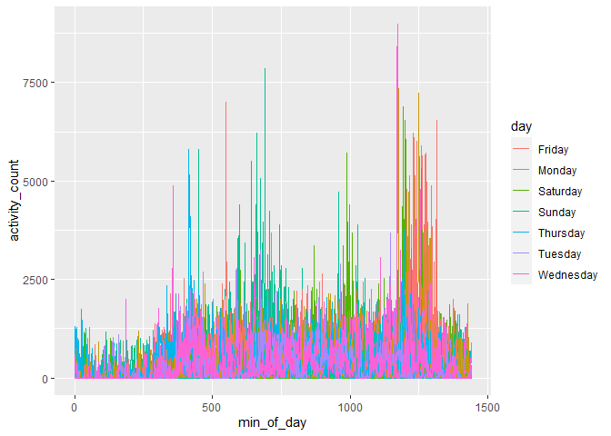

Homework 3
================
Krishna Vemulapalli

``` r
library(tidyverse)
```

    ## -- Attaching packages ----------------------------------------------------------- tidyverse 1.3.0 --

    ## v ggplot2 3.3.2     v purrr   0.3.4
    ## v tibble  3.0.3     v dplyr   1.0.2
    ## v tidyr   1.1.2     v stringr 1.4.0
    ## v readr   1.3.1     v forcats 0.5.0

    ## -- Conflicts -------------------------------------------------------------- tidyverse_conflicts() --
    ## x dplyr::filter() masks stats::filter()
    ## x dplyr::lag()    masks stats::lag()

``` r
library(ggplot2)
library(knitr)
library(janitor)
```

    ## 
    ## Attaching package: 'janitor'

    ## The following objects are masked from 'package:stats':
    ## 
    ##     chisq.test, fisher.test

## Problem 1

``` r
library(p8105.datasets)
data("instacart")
```

Data description:

*How many aisles are there, and which aisles are the most items ordered
from?*

``` r
no_aisles = instacart %>% 
            distinct(aisle) %>% 
            count()

aisle_orders = instacart %>% 
               count(aisle) %>% 
               arrange(desc(n))

#The top five aisles that have the most items ordered from are as follows:#
aisle_orders %>% select(aisle) %>% head(5)
```

    ## # A tibble: 5 x 1
    ##   aisle                     
    ##   <chr>                     
    ## 1 fresh vegetables          
    ## 2 fresh fruits              
    ## 3 packaged vegetables fruits
    ## 4 yogurt                    
    ## 5 packaged cheese

There are 134 aisles in the instacart.

*Make a plot that shows the number of items ordered in each aisle,
limiting this to aisles with more than 10000 items ordered. Arrange
aisles sensibly, and organize your plot so others can read it.*

``` r
aisle_orders_10000 = aisle_orders %>% filter(n > 10000) #limiting the dataset to contain only aisles that have orders more than 10000 items#

ggplot(aisle_orders_10000, aes(x = reorder(aisle, desc(n)), y = n)) + 
  geom_point() + 
  theme(axis.text.x = element_text(angle = 90))
```

<!-- -->

*Make a table showing the three most popular items in each of the aisles
“baking ingredients”, “dog food care”, and “packaged vegetables fruits”.
Include the number of times each item is ordered in your table.*

``` r
instacart %>% 
  filter(aisle %in% c("baking ingredients","dog food care","packaged vegetables fruits")) %>%
  group_by(aisle) %>% 
  count(product_name) %>%
  mutate(rank = min_rank(desc(n))) %>%
  filter(rank < 4) %>%
  arrange(aisle, rank) %>%
  select(-rank) %>%
  kable()
```

| aisle                      | product\_name                                 |    n |
| :------------------------- | :-------------------------------------------- | ---: |
| baking ingredients         | Light Brown Sugar                             |  499 |
| baking ingredients         | Pure Baking Soda                              |  387 |
| baking ingredients         | Cane Sugar                                    |  336 |
| dog food care              | Snack Sticks Chicken & Rice Recipe Dog Treats |   30 |
| dog food care              | Organix Chicken & Brown Rice Recipe           |   28 |
| dog food care              | Small Dog Biscuits                            |   26 |
| packaged vegetables fruits | Organic Baby Spinach                          | 9784 |
| packaged vegetables fruits | Organic Raspberries                           | 5546 |
| packaged vegetables fruits | Organic Blueberries                           | 4966 |

*Make a table showing the mean hour of the day at which Pink Lady Apples
and Coffee Ice Cream are ordered on each day of the week; format this
table for human readers (i.e. produce a 2 x 7 table).*

``` r
instacart %>% 
  filter(product_name %in% c("Pink Lady Apples", "Coffee Ice Cream")) %>%
  group_by(product_name, order_dow) %>%
  summarize(mean_hour_of_day = mean(order_hour_of_day)) %>%
  pivot_wider(
    names_from = order_dow,
    values_from = mean_hour_of_day
  ) %>%
  kable()
```

    ## `summarise()` regrouping output by 'product_name' (override with `.groups` argument)

| product\_name    |        0 |        1 |        2 |        3 |        4 |        5 |        6 |
| :--------------- | -------: | -------: | -------: | -------: | -------: | -------: | -------: |
| Coffee Ice Cream | 13.77419 | 14.31579 | 15.38095 | 15.31818 | 15.21739 | 12.26316 | 13.83333 |
| Pink Lady Apples | 13.44118 | 11.36000 | 11.70213 | 14.25000 | 11.55172 | 12.78431 | 11.93750 |

## Problem 2

*Load, tidy, and otherwise wrangle the data. Your final dataset should
include all originally observed variables and values; have useful
variable names; include a weekday vs weekend variable; and encode data
with reasonable variable classes. Describe the resulting dataset
(e.g. what variables exist, how many observations, etc).*

``` r
accel = read.csv("data/accel_data.csv") %>% 
        pivot_longer(activity.1:activity.1440, 
                     names_to = "min_of_day",
                     names_prefix = "activity.",
                     values_to = "activity_count") %>%
        mutate(day_class = ifelse(day == "Saturday" | day == "Sunday", 
                       "weekend", "weekday"), min_of_day = as.numeric(min_of_day)) %>%
        clean_names() %>%
        select(week, day_id, day_class, day, min_of_day, activity_count)
```

Description of Accelerometer dataset:

This dataset consists of five weeks of accelerometer data collected on a
63 year-old male with BMI 25, who was admitted to the Advanced Cardiac
Care Center of Columbia University Medical Center and diagnosed with
congestive heart failure (CHF). The initial dataset has been transformed
from a wide format structure to a long format dataset. After performing
other manipulations and cleaning, a dataset with the following variables
has been created: week, day\_id, day\_class, day, min\_of\_day,
activity\_count. Currently, this dataset consists of 50400 observations.
The dimensions of the dataset are as follows: 50400, 6 (rows, columns).
The min\_of\_day variable records the minutes of the day and
activity\_count records the activity performed at that respective
minute.

*Traditional analyses of accelerometer data focus on the total activity
over the day. Using your tidied dataset, aggregate accross minutes to
create a total activity variable for each day, and create a table
showing these totals. Are any trends apparent?*

``` r
accel %>% 
  mutate(day = factor(day, levels = c("Monday", 
         "Tuesday", "Wednesday", "Thursday", "Friday", "Saturday", "Sunday"))) %>%
  group_by(week, day_id,  day_class, day) %>%
  summarize(actvity_day_total = sum(activity_count)) %>%
  kable() 
```

| week | day\_id | day\_class | day       | actvity\_day\_total |
| ---: | ------: | :--------- | :-------- | ------------------: |
|    1 |       1 | weekday    | Friday    |           480542.62 |
|    1 |       2 | weekday    | Monday    |            78828.07 |
|    1 |       3 | weekend    | Saturday  |           376254.00 |
|    1 |       4 | weekend    | Sunday    |           631105.00 |
|    1 |       5 | weekday    | Thursday  |           355923.64 |
|    1 |       6 | weekday    | Tuesday   |           307094.24 |
|    1 |       7 | weekday    | Wednesday |           340115.01 |
|    2 |       8 | weekday    | Friday    |           568839.00 |
|    2 |       9 | weekday    | Monday    |           295431.00 |
|    2 |      10 | weekend    | Saturday  |           607175.00 |
|    2 |      11 | weekend    | Sunday    |           422018.00 |
|    2 |      12 | weekday    | Thursday  |           474048.00 |
|    2 |      13 | weekday    | Tuesday   |           423245.00 |
|    2 |      14 | weekday    | Wednesday |           440962.00 |
|    3 |      15 | weekday    | Friday    |           467420.00 |
|    3 |      16 | weekday    | Monday    |           685910.00 |
|    3 |      17 | weekend    | Saturday  |           382928.00 |
|    3 |      18 | weekend    | Sunday    |           467052.00 |
|    3 |      19 | weekday    | Thursday  |           371230.00 |
|    3 |      20 | weekday    | Tuesday   |           381507.00 |
|    3 |      21 | weekday    | Wednesday |           468869.00 |
|    4 |      22 | weekday    | Friday    |           154049.00 |
|    4 |      23 | weekday    | Monday    |           409450.00 |
|    4 |      24 | weekend    | Saturday  |             1440.00 |
|    4 |      25 | weekend    | Sunday    |           260617.00 |
|    4 |      26 | weekday    | Thursday  |           340291.00 |
|    4 |      27 | weekday    | Tuesday   |           319568.00 |
|    4 |      28 | weekday    | Wednesday |           434460.00 |
|    5 |      29 | weekday    | Friday    |           620860.00 |
|    5 |      30 | weekday    | Monday    |           389080.00 |
|    5 |      31 | weekend    | Saturday  |             1440.00 |
|    5 |      32 | weekend    | Sunday    |           138421.00 |
|    5 |      33 | weekday    | Thursday  |           549658.00 |
|    5 |      34 | weekday    | Tuesday   |           367824.00 |
|    5 |      35 | weekday    | Wednesday |           445366.00 |

It can be inferred from the table above that this individual didn’t
perform a lot of activity on the Saturdays of Week 4 and Week 5. The
individual also seems to have performed lower amount of activity on the
Monday of Week 1 (day 2), when compared to the activity of the other
days. Compared to all the weeks, it seems like Week 4 recorded the least
amount of activity.

*Accelerometer data allows the inspection activity over the course of
the day. Make a single-panel plot that shows the 24-hour activity time
courses for each day and use color to indicate day of the week. Describe
in words any patterns or conclusions you can make based on this graph*

``` r
accel %>% 
 ggplot(aes(x = min_of_day, y = activity_count)) +
       geom_smooth(aes(color = day)) +
       facet_wrap(~day_id)
```

    ## Warning: Computation failed in `stat_smooth()`:
    ## NA/NaN/Inf in foreign function call (arg 3)
    
    ## Warning: Computation failed in `stat_smooth()`:
    ## NA/NaN/Inf in foreign function call (arg 3)

<!-- -->

From the above single-panel plot, we can deduce that the individual
usually performed high activity on Fridays, especially towards the end
of the day. However, day 22 seems to be an exception where there wasn’t
any high level of activity recorded towards the end of the day.
Saturdays seem to have high amounts of activity recorded during the
middle of the day, while the Sundays had steady level of activity. Day
16 recorded the highest amount of activity during the end of the day,
when compared to the activity performed on the other days. One can also
infer that there was more amount of activity registered during the
beginning weeks (week 1, week 2, week 3), when compared to the other
weeks.

## Problem 3
